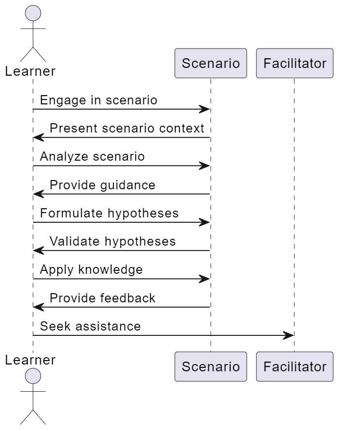

# ✨ Our Features


T**ip:** _We have an exciting journey ahead, and we can't wait to share it with you in real-time on WhatsApp. Join us today to stay updated and connected!_


## Scenario Based Learning

Engage in real-world scenarios to apply theoretical knowledge, fostering practical problem-solving skills.

<figure><figcaption></figcaption></figure>

<figure><figcaption></figcaption></figure>

## Project Based Learning

Dive into hands-on projects to grasp concepts through tangible outcomes, cultivating expertise while working on meaningful tasks.

<figure><figcaption></figcaption></figure>

## Mentoring & Coaching

Receive personalized guidance and support from experienced mentors, accelerating your growth and refining your skills.

## Workshop Sessions

Participate in interactive workshops that offer immersive learning experiences, encouraging active engagement and knowledge retention.

## Self-Paced Learning

Learn at your own rhythm, accessing resources and lessons when it suits you best, empowering a flexible and personalized educational journey.

## Live Classes

Join real-time virtual classes led by experts, enabling dynamic discussions and immediate clarification of concepts.

